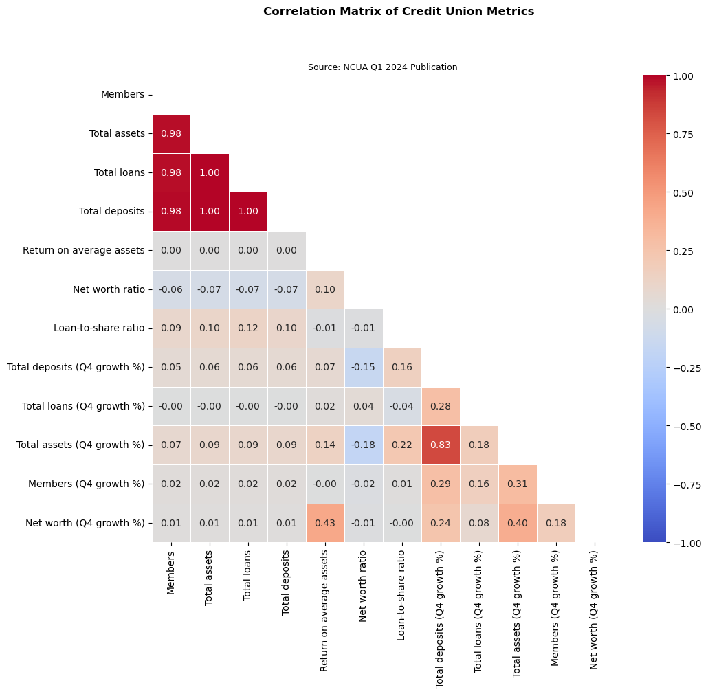

# Correlation Analysis of Credit Union Metrics

## Introduction
In this analysis, we explore key metrics of credit unions using a correlation matrix. The dataset includes information on Federally Insured Credit Unions including total assets, loans, deposits, members, and growth rates for Q1 2024. It was sourced from the National Credit Union Administration (NCUA) (https://www.ncua.gov/files/publications/analysis/federally-insured-credit-union-list-march-2024.zip).

## Methodology
We performed data cleaning, calculated correlation matrices, and visualized the results using heatmaps and other charts. The analysis was conducted using Python, Pandas, Seaborn, and Matplotlib.

## Results
The correlation matrix heatmap reveals several strong relationships:
- **Total Assets** and **Total Loans** have a high positive correlation, indicating that as assets increase, loans tend to increase as well.
- **Members** and **Total Deposits** are positively correlated, suggesting that credit unions with more members also have higher deposits.
- Growth metrics show varying levels of correlation with other variables, providing insights into how different factors influence growth.

## Future Work
This analysis is a starting point for more advanced data science projects. Future work could include predictive modeling, deeper exploration of causation, and application of machine learning techniques to identify trends and patterns.

## Conclusion
This analysis highlights significant correlations between key credit union metrics. These insights can inform further analysis and decision-making processes. I look forward to continuing this journey and sharing more advanced projects in the future.

## Code and Notebooks
You can view the full analysis and code in the following Jupyter Notebooks hosted on my [GitHub repository](https://github.com/DataSciSanj/credit-union-analysis):
- [Data Cleaning and Preparation](./credit-union-analysis-1-data-clean-prep.ipynb)
- [Visualization Exploration](./credit-union-analysis-2-visualization-exploration.ipynb)
- [Exploratory Data Analysis](./credit-union-analysis-3-eda.md)
